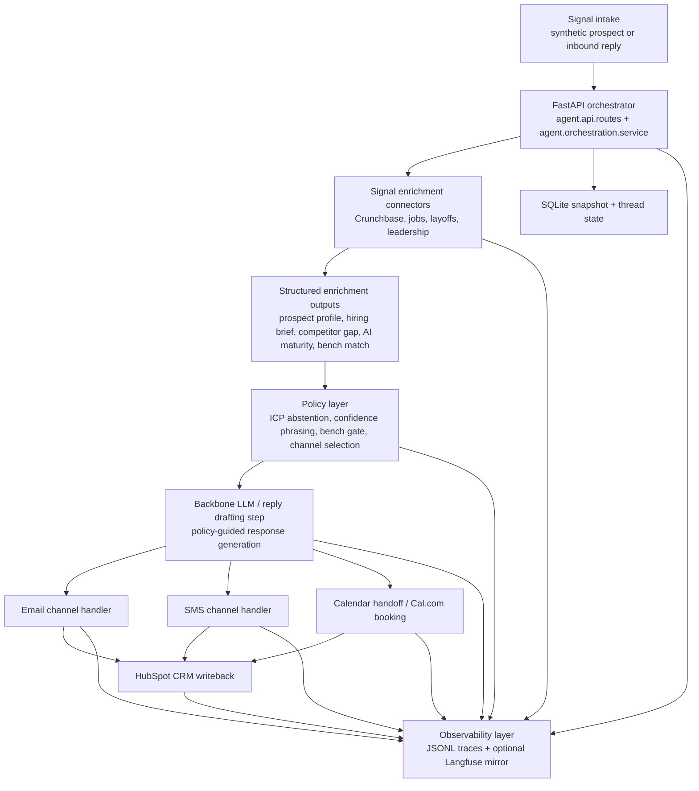

# The Conversion Engine

End-to-end implementation slice for the Week 10 Tenacious conversion engine challenge. This repo is organized as a FastAPI-based orchestration layer that enriches a prospect, applies policy guards, drafts channel actions, writes CRM/calendar artifacts, and records evidence for review.

## What exists today

- FastAPI application entrypoint and dashboard
- Typed schemas for prospects, briefs, bench match, and conversation decisions
- SQLite-backed repository for synthetic prospect records
- JSONL trace logging for evidence-friendly development
- Integration-aware toolchain across enrichment, email, SMS, CRM, scheduling, observability, and benchmark readiness
- Confidence-aware ICP classifier with abstention
- Bench-gated commitment policy loaded from Tenacious seed materials
- Email reply handler for pricing guardrails, scheduling, SMS handoff, and opt-out
- Act I-IV evidence artifacts and a draft decision memo

## Architecture Diagram



### Data-flow notes

- Enrichment starts in [`agent/enrichment/`](./agent/enrichment) and produces structured briefs before outreach is drafted.
- Policy decisions live in [`agent/policies/`](./agent/policies) and sit between enrichment outputs and generation.
- The reply-drafting backbone is the conversation-generation step used by the orchestrator and inbound-reply handler in [`agent/orchestration/service.py`](./agent/orchestration/service.py).
- Channel handlers live in [`agent/channels/`](./agent/channels), CRM sync in [`agent/crm/`](./agent/crm), scheduling in [`agent/scheduling/`](./agent/scheduling), and traces in [`agent/observability/`](./agent/observability).

## Safety And Kill Switch

Outbound is disabled by default. Even if provider credentials are present, email and SMS adapters write local draft artifacts unless:

```bash
OUTBOUND_ENABLED=true
```

This is intentional. Challenge-week prospects must remain synthetic or staff-controlled until Tenacious and program staff approve live deployment.

## Local Setup

### Environment prerequisites

| Requirement | Version | Why it is needed |
|---|---:|---|
| Python | 3.12 | The project requires Python 3.12+ and the checked-in virtualenv/cache artifacts were produced on Python 3.12. |
| `uv` | Current stable | Dependency sync and `uv run` are the supported local bootstrap path in this repo. |
| SQLite | Bundled with Python | Prospect snapshots and thread state are persisted locally through the standard Python SQLite module. |
| Git | Current stable | Needed to clone the repo and, if you want eval parity, manage the `eval/tau2-bench` submodule checkout. |

### Pinned dependency versions

The supported dependency set is the lockfile-backed set in [`uv.lock`](./uv.lock). The project metadata in [`pyproject.toml`](./pyproject.toml) is pinned to the same versions:

| Package | Version |
|---|---:|
| `fastapi` | `0.115.12` |
| `uvicorn[standard]` | `0.34.2` |
| `pydantic` | `2.11.4` |
| `httpx` | `0.28.1` |
| `langfuse` | `4.5.0` |
| `python-dotenv` | `1.2.2` |
| `pytest` | `9.0.3` |
| `ruff` | `0.15.11` |

### Explicit local bootstrap order

1. Create a Python 3.12 environment, or let `uv` manage it for you.
2. Copy the sample environment file:

```bash
cp .env.example .env
```

3. Review `.env` and keep `OUTBOUND_ENABLED=false` for local preview work.
4. Sync the exact locked dependencies:

```bash
uv sync --frozen --group dev
```

5. Start the API:

```bash
uv run uvicorn agent.main:app --reload
```

6. Open the FastAPI docs at `http://127.0.0.1:8000/docs`.
7. Run the local test suite:

```bash
uv run pytest -q
```

8. Only after the preview path works, add provider credentials if you want live integrations. Email and SMS still remain non-live until `OUTBOUND_ENABLED=true`.
9. Optional for benchmark work only: initialize or repair the `eval/tau2-bench` checkout before running eval scripts. See the handoff notes below, because the checked-in `.gitmodules` entry still uses a placeholder URL.

### Provider setup notes

Use one email provider at a time.

For Resend:

```bash
EMAIL_PROVIDER=resend
RESEND_API_KEY=...
RESEND_FROM_EMAIL=you@your-verified-domain.com
RESEND_REPLY_TO=you@your-verified-domain.com
```

For MailerSend:

```bash
EMAIL_PROVIDER=mailersend
MAILERSEND_API_KEY=...
MAILERSEND_FROM_EMAIL=you@your-verified-domain.com
MAILERSEND_FROM_NAME=Tenacious
```

For Africa's Talking sandbox:

```bash
SMS_PROVIDER=africastalking
AFRICASTALKING_USERNAME=sandbox
AFRICASTALKING_API_KEY=...
AFRICASTALKING_SENDER_ID=TENACIOUS
```

Do not set `EMAIL_PROVIDER=africastalking`; Africa's Talking is only for `SMS_PROVIDER`. Resend and MailerSend both require a verified from address or domain before live delivery works. For a live Africa's Talking app, replace `sandbox` with the real app username and use a sender ID or short code approved in that account.

## Configuration Reference

The repo ships with an [`.env.example`](./.env.example) file. The table below explains every configuration variable used by the app and eval wrappers.

### Core app and model settings

| Variable | Required for | Purpose |
|---|---|---|
| `APP_BASE_URL` | Local and deployed app | Base URL used for deployment info and recommended webhook URLs. |
| `OUTBOUND_ENABLED` | Live sends only | Global kill switch. When `false`, email and SMS providers write preview artifacts instead of sending. |
| `OPENROUTER_API_KEY` | Eval or any OpenRouter-backed model workflow | API key for model access in benchmark or evaluation tooling. |
| `OPENROUTER_MODEL` | Eval or model-backed runs | Default model identifier for eval wrappers that use OpenRouter. |

### Email settings

| Variable | Required for | Purpose |
|---|---|---|
| `EMAIL_PROVIDER` | Any email action | Selects `mock`, `resend`, or `mailersend`. |
| `RESEND_API_KEY` | Resend live/configured mode | API credential for Resend. |
| `RESEND_FROM_EMAIL` | Resend | Sender address for outbound email drafts or live sends. |
| `RESEND_REPLY_TO` | Resend optional | Reply-to address for Resend messages. |
| `RESEND_WEBHOOK_SECRET` | Resend webhook verification | Shared secret for inbound Resend webhook validation or future hardening. |
| `MAILERSEND_API_KEY` | MailerSend live/configured mode | API credential for MailerSend. |
| `MAILERSEND_FROM_EMAIL` | MailerSend | Sender address for MailerSend. |
| `MAILERSEND_FROM_NAME` | MailerSend | Display name for MailerSend outbound messages. |

### SMS settings

| Variable | Required for | Purpose |
|---|---|---|
| `SMS_PROVIDER` | Any SMS action | Selects `mock` or `africastalking`. |
| `AFRICASTALKING_USERNAME` | Africa's Talking configured/live mode | Sandbox or production username for SMS delivery. |
| `AFRICASTALKING_API_KEY` | Africa's Talking configured/live mode | API credential for SMS delivery. |
| `AFRICASTALKING_SENDER_ID` | Africa's Talking | Sender ID or shortcode label for outbound SMS. |

### CRM settings

| Variable | Required for | Purpose |
|---|---|---|
| `HUBSPOT_ACCESS_TOKEN` | Live CRM sync | Private app token for HubSpot contact/event upserts. |
| `HUBSPOT_BASE_URL` | HubSpot integration | Base API URL for HubSpot requests. |
| `HUBSPOT_WEBHOOK_SECRET` | HubSpot webhook verification | Shared secret placeholder for webhook hardening. |

### Calendar settings

| Variable | Required for | Purpose |
|---|---|---|
| `CALCOM_API_KEY` | Live calendar booking | API key for Cal.com. |
| `CALCOM_API_BASE` | Cal.com integration | Base API URL for Cal.com requests. |
| `CALCOM_API_VERSION` | Cal.com integration | Version header value expected by the current adapter. |
| `CALCOM_EVENT_TYPE_ID` | Live booking | Target event type ID used for booking creation. |
| `CALCOM_USERNAME` | Cal.com optional | Username used for scheduling context or downstream linking. |
| `CALCOM_EVENT_TYPE_SLUG` | Preview and live booking | Human-readable slug for the event type. |
| `CALCOM_DEFAULT_TIMEZONE` | Scheduling | Default timezone when the prospect timezone is unknown. |
| `CALCOM_WEBHOOK_SECRET` | Cal.com webhook verification | Shared secret placeholder for webhook hardening. |

### Observability settings

| Variable | Required for | Purpose |
|---|---|---|
| `LANGFUSE_PUBLIC_KEY` | Langfuse export | Public key for Langfuse. |
| `LANGFUSE_SECRET_KEY` | Langfuse export | Secret key for Langfuse. |
| `LANGFUSE_HOST` | Langfuse export | Target Langfuse host, defaulting to the cloud endpoint. |
| `LANGFUSE_EXPORT_ENABLED` | Live Langfuse export | Gate that enables remote export instead of local mirror-only behavior. |

### Data and evaluation paths

| Variable | Required for | Purpose |
|---|---|---|
| `CRUNCHBASE_SNAPSHOT_PATH` | Enrichment | Path to the Crunchbase-style company snapshot JSON. |
| `JOB_POSTS_SNAPSHOT_PATH` | Enrichment | Path to the job-post snapshot JSON. |
| `LAYOFFS_SNAPSHOT_PATH` | Enrichment | Path to the layoffs snapshot JSON. |
| `LEADERSHIP_SNAPSHOT_PATH` | Enrichment | Path to the leadership-change snapshot JSON. |
| `BENCH_SUMMARY_PATH` | Bench gating | Path to the Tenacious bench-capacity seed file. |
| `LAYOFFS_CSV_URL` | Optional enrichment refresh work | Optional remote CSV source for future layoffs refresh logic. |
| `TAU2_BENCH_PATH` | Evaluation | Filesystem path to the tau2 benchmark checkout used by eval scripts. |

## Directory Index

Every top-level folder currently present at the repo root is mapped below.

- `.git/`: Git metadata for the repository. A successor usually does not edit this directly, but it matters for submodules and branch state.
- `.pytest_cache/`: Local pytest cache from previous runs. Safe to delete; not part of the product surface.
- `.ruff_cache/`: Local Ruff cache from previous lint runs. Safe to delete; not part of the product surface.
- `.venv/`: Local virtual environment generated during development. Useful for this checkout, but a fresh inheritor can recreate it with `uv sync`.
- `agent/`: Main application package. It contains the API routes, orchestration logic, enrichment services, policy layer, channel adapters, CRM/calendar integrations, observability, schemas, storage layer, and local data artifacts.
- `docs/`: Reference material and reporting docs. This includes supporting challenge materials, interim client-facing reports, and Tenacious seed data.
- `eval/`: Evaluation assets and wrappers. This is where local score artifacts, baseline notes, the tau2 wrapper script, and the benchmark checkout live.
- `planning/`: Build-planning documents. These files explain the implementation requirements and early design choices behind the system.
- `probes/`: Probe and failure-analysis material. Use this folder to understand the targeted failure modes and challenge-specific evaluation probes.
- `tests/`: Unit-style regression coverage for enrichment/policy behavior and for channel/CRM/scheduling adapter behavior.

## Current Endpoints

- `GET /health`
- `GET /deploy/info`
- `GET /dashboard`
- `GET /dashboard/state`
- `GET /tools/status`
- `POST /prospects/enrich`
- `POST /pipeline/run`
- `POST /conversations/reply`
- `GET /prospects`
- `GET /prospects/{prospect_id}`
- `POST /webhooks/resend`
- `POST /webhooks/africastalking`
- `POST /webhooks/calcom`
- `POST /webhooks/hubspot`

## Render

This repo includes [render.yaml](/home/nurye/Desktop/TRP1/week10/TheConversionEngine/render.yaml) so you can deploy the FastAPI app to Render's free tier as a public webhook backend.

After deployment:

1. Set `APP_BASE_URL` to your Render service URL.
2. Register these webhook URLs with providers:

```text
{APP_BASE_URL}/webhooks/resend
{APP_BASE_URL}/webhooks/africastalking
{APP_BASE_URL}/webhooks/calcom
{APP_BASE_URL}/webhooks/hubspot
```

3. Verify the deployment at:

```text
{APP_BASE_URL}/health
{APP_BASE_URL}/deploy/info
```

## Planning Docs

- [Requirements](./planning/requirements.md)
- [Design](./planning/design.md)

## Challenge Artifacts

- [Baseline](./eval/baseline.md)
- [Score log](./eval/score_log.json)
- [Eval README](./eval/README.md)
- [Probe library](./probes/probe_library.md)
- [Failure taxonomy](./probes/failure_taxonomy.md)
- [Target failure mode](./probes/target_failure_mode.md)
- [Method](./method.md)
- [Ablation results](./ablation_results.json)
- [Evidence graph](./evidence_graph.json)
- [Decision memo draft](./memo.md)

## Known Limitations And Successor Next Steps

- Live provider verification is still incomplete from this shell environment. The orchestration path and local artifacts exist, but HubSpot, Cal.com, and some outbound requests previously failed with name-resolution errors; see [docs/interim_client_progress_report.md](./docs/interim_client_progress_report.md).
- The benchmark submodule metadata is not fresh-clone ready yet. [`.gitmodules`](./.gitmodules) still points `eval/tau2-bench` at `https://github.com/YOUR_GITHUB_USERNAME/tau2-bench.git`, so a successor should repair that URL or vendor the benchmark another way before relying on `git submodule update --init --recursive`.
- Company-level deduplication is not implemented. [memo.md](./memo.md) calls out the concrete risk: two contacts from the same company can receive different pitch framings on the same day.
- Voice remains intentionally out of scope for the current implementation. The repo treats voice as the human discovery-call endpoint, so any scored requirement for automated voice would be new work rather than hidden functionality.
- The repo contains local-generated state in `agent/data/`, `.venv/`, `.pytest_cache/`, and `.ruff_cache/`. A successor should decide whether to keep those artifacts for evidence review or clean them before packaging the repo.

### Recommended first tasks for a successor

1. Keep the app in preview mode, run `uv sync --frozen --group dev`, and verify the local happy path through `/pipeline/run`.
2. Repair the `eval/tau2-bench` submodule source before trying to reproduce the benchmark flow from a clean clone.
3. Re-run `uv run pytest -q` and the eval wrappers in a clean, network-enabled environment before making stronger live-integration claims.
4. Implement company-level dedupe or throttling before any real multi-contact outreach workflow is considered.

## Notes

- This implementation is demo-ready with local artifacts and provider-ready adapters; it is not approved for real prospect outreach.
- External providers run in configured mode only when their credentials are present; otherwise the app records honest local preview artifacts in `agent/data/outbox/`.
- Email and SMS also require `OUTBOUND_ENABLED=true`; credentials alone are not enough.
- `.env` is loaded automatically at startup via `python-dotenv`.
- Raw webhook payloads are captured in `agent/data/webhooks/` for debugging and traceability.
- Local enrichment snapshots live in `agent/data/snapshots/` by default and can be overridden with environment variables.
- Trace files are written to `agent/data/traces.jsonl`.
